# Quest Application Module Structure

## Overview
This diagram shows the complete module structure of the Django Quest application, including core components, data models, views, and their relationships.

## Module Structure Diagram

```mermaid
graph TB
    %% Main Project Structure
    subgraph "Django Project: my_quest"
        A[my_quest/] --> A1[settings.py]
        A --> A2[urls.py]
        A --> A3[wsgi.py]
        A --> A4[asgi.py]
    end

    %% Quest App Structure
    subgraph "Quest App: quest/"
        B[quest/] --> B1[models.py]
        B --> B2[views.py]
        B --> B3[urls.py]
        B --> B4[admin.py]
        B --> B5[apps.py]
        B --> B6[templates/]
        B --> B7[static/]
        B --> B8[migrations/]
        B --> B9[templatetags/]
    end

    %% Data Models
    subgraph "Data Models"
        M1[Question] --> M2[Answer]
        M3[Test] --> M1
        M4[TestResult] --> M3
        M4 --> M5[User]
        M6[QuestionResponse] --> M4
        M6 --> M1
        M6 --> M2
        
        %% Quest System Models
        M7[QuestSequence] --> M8[Quest]
        M8 --> M3
        M9[QuestProgress] --> M8
        M9 --> M5
        M10[SequenceProgress] --> M7
        M10 --> M8
        M10 --> M5
    end

    %% Views Structure
    subgraph "Views & Controllers"
        V1[Test Views] --> V11[test_list]
        V1 --> V12[start_test]
        V1 --> V13[take_test]
        V1 --> V14[test_result]
        
        V2[Quest Views] --> V21[quest_sequence_list]
        V2 --> V22[quest_sequence_detail]
        V2 --> V23[quest_detail]
        V2 --> V24[start_quest_test]
        V2 --> V25[take_quest_test]
        V2 --> V26[quest_test_result]
        V2 --> V27[guess_code]
        
        V3[API Views] --> V31[get_questions]
        V3 --> V32[questions_list]
    end

    %% Templates Structure
    subgraph "Templates & UI"
        T1[quest/templates/] --> T11[test_list.html]
        T1 --> T12[take_test.html]
        T1 --> T13[test_result.html]
        T1 --> T14[quest_sequence_list.html]
        T1 --> T15[quest_sequence_detail.html]
        T1 --> T16[quest_detail.html]
        T1 --> T17[take_quest_test.html]
        T1 --> T18[quest_test_result.html]
        T1 --> T19[questions_list.html]
        
        T2[registration/] --> T21[login.html]
    end

    %% URL Routing
    subgraph "URL Routing"
        U1[my_quest/urls.py] --> U11[admin/]
        U1 --> U12[api/questions/]
        U1 --> U13[questions/]
        U1 --> U14[login/logout]
        U1 --> U15[i18n/]
        U1 --> U2[quest/urls.py]
        
        U2 --> U21[tests/]
        U2 --> U22[quests/]
        U2 --> U23[quest sequences/]
    end

    %% External Dependencies
    subgraph "External Dependencies"
        E1[Django Framework] --> E11[User Authentication]
        E1 --> E12[Admin Interface]
        E1 --> E13[ORM/Database]
        E1 --> E14[Template Engine]
        E1 --> E15[Static Files]
        E1 --> E16[Internationalization]
        
        E2[Database] --> E21[SQLite/PostgreSQL]
        E3[Static Assets] --> E31[CSS/JS Files]
        E3 --> E32[Images/Media]
    end

    %% Component Relationships
    A2 -.-> B3
    B2 -.-> B1
    B1 -.-> E13
    B2 -.-> B6
    B3 -.-> B2
    B4 -.-> B1
    
    %% Data Flow
    V11 -.-> M3
    V12 -.-> M4
    V13 -.-> M4
    V13 -.-> M6
    V14 -.-> M4
    
    V21 -.-> M7
    V22 -.-> M10
    V23 -.-> M9
    V24 -.-> M8
    V25 -.-> M4
    V26 -.-> M4
    V27 -.-> M9
    
    %% UI Connections
    V11 -.-> T11
    V12 -.-> T12
    V13 -.-> T12
    V14 -.-> T13
    V21 -.-> T14
    V22 -.-> T15
    V23 -.-> T16
    V25 -.-> T17
    V26 -.-> T18
    V32 -.-> T19

    %% Styling
    classDef modelClass fill:#e1f5fe,stroke:#01579b,stroke-width:2px
    classDef viewClass fill:#f3e5f5,stroke:#4a148c,stroke-width:2px
    classDef templateClass fill:#e8f5e8,stroke:#1b5e20,stroke-width:2px
    classDef configClass fill:#fff3e0,stroke:#e65100,stroke-width:2px
    classDef externalClass fill:#fce4ec,stroke:#880e4f,stroke-width:2px

    class M1,M2,M3,M4,M5,M6,M7,M8,M9,M10 modelClass
    class V1,V2,V3,V11,V12,V13,V14,V21,V22,V23,V24,V25,V26,V27,V31,V32 viewClass
    class T1,T2,T11,T12,T13,T14,T15,T16,T17,T18,T19,T21 templateClass
    class A1,A2,A3,A4,B3,B4,B5,U1,U2,U11,U12,U13,U14,U15,U21,U22,U23 configClass
    class E1,E2,E3,E11,E12,E13,E14,E15,E16,E21,E31,E32 externalClass
```

## Component Descriptions

### Core Models
- **Question**: Stores quiz questions with optional images
- **Answer**: Multiple choice answers linked to questions
- **Test**: Collections of questions forming complete tests
- **TestResult**: Tracks student progress and scores
- **QuestionResponse**: Records individual question answers

### Quest System Models
- **QuestSequence**: Ordered series of quests
- **Quest**: Individual quest with associated test and code
- **QuestProgress**: Tracks student progress through quests
- **SequenceProgress**: Tracks progress through quest sequences

### Views & Controllers
- **Test Views**: Handle test taking and result display
- **Quest Views**: Manage quest sequences and progression
- **API Views**: Provide JSON endpoints for questions

### Templates & UI
- **Test Templates**: UI for taking tests and viewing results
- **Quest Templates**: UI for quest sequences and individual quests
- **Registration Templates**: User authentication forms

### Key Features
1. **Progressive Quest System**: Students unlock quests by completing previous ones
2. **Code Revelation**: Correct answers reveal letters of secret codes
3. **Multi-language Support**: Internationalization ready
4. **User Authentication**: Built-in Django auth system
5. **Admin Interface**: Django admin for content management
6. **Responsive Design**: Modern UI with progress tracking

## Data Flow
1. Students log in through Django auth
2. Navigate to quest sequences or individual tests
3. Progress is tracked in real-time
4. Correct answers reveal code letters
5. Completed quests unlock subsequent ones
6. Results and progress are persistently stored 