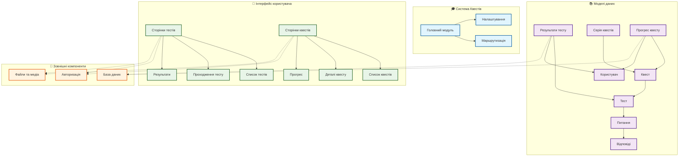

# Структура Системи Квестів - Технічний Огляд

## Загальний опис
Цей документ показує спрощену технічну структуру системи навчальних квестів, її основні компоненти та їх взаємозв'язки.

## Діаграма структури

## Опис компонентів

### 📊 Основні моделі
- **Питання**: Зберігає питання тестів
- **Відповіді**: Варіанти відповідей
- **Тест**: Набір питань
- **Результати**: Відповіді та оцінки користувачів

### 🎮 Система квестів
- **Серія квестів**: Послідовність завдань
- **Квест**: Окреме завдання з тестом
- **Прогрес**: Стан проходження квестів

### 🖥️ Інтерфейс
- **Тести**: Проходження тестувань
- **Квести**: Управління квестами
- **Результати**: Перегляд досягнень

### ⚙️ Технічні особливості
1. **База даних**: Зберігання всієї інформації
2. **Авторизація**: Захист даних користувачів
3. **Медіа**: Зображення та файли

## Процес роботи
1. Вхід користувача в систему
2. Вибір квесту або тесту
3. Проходження завдань
4. Збереження результатів
5. Відкриття нових квестів

## Переваги архітектури
- 🔒 **Безпека**: Надійна система авторизації
- 📱 **Гнучкість**: Легко розширюється
- 🚀 **Швидкість**: Оптимізована робота
- 📊 **Аналітика**: Детальна статистика 