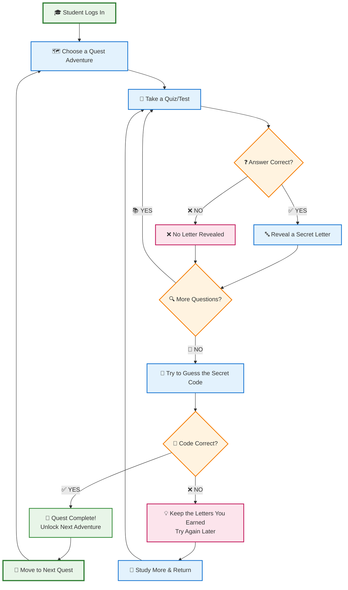
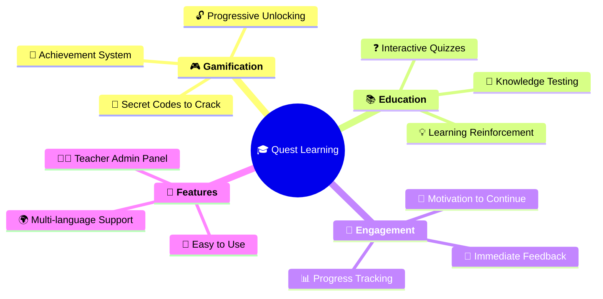

# Quest Learning System - Simple Overview

## What is the Quest System?

The Quest System is a **gamified learning platform** that makes education fun and engaging by turning tests into adventure-like quests with hidden codes to discover!

## How It Works - Simple Flow

## 🎮 Key Features Explained Simply

### 🎯 **The Goal**
Help students learn through **gamified quizzes** where correct answers unlock pieces of a secret code!

### 🔄 **The Process**
1. **📚 Learn** → Take educational quizzes
2. **🎯 Earn** → Get letters for correct answers  
3. **🔍 Discover** → Guess the hidden code
4. **🚀 Progress** → Unlock new adventures

### 🏆 **What Makes It Special**

## 🎭 **Real-World Example**

**Scenario: Geography Quest**

1. 🗺️ **Quest**: "Discover the Mystery Country"
2. 📝 **Quiz**: Answer 10 geography questions
3. 🔤 **Rewards**: Each correct answer reveals 1 letter
4. 🎯 **Goal**: Spell out "**BRAZIL**" (6 letters)
5. 🎉 **Success**: Unlock the next quest about South American capitals!

## 👨‍🎓 **Perfect For**
- **Students**: Fun, engaging way to learn
- **Teachers**: Easy to create and track progress  
- **Schools**: Modern, interactive education tool
- **Anyone**: Who wants to make learning enjoyable!

---

*Transform boring tests into exciting adventures! 🚀* 