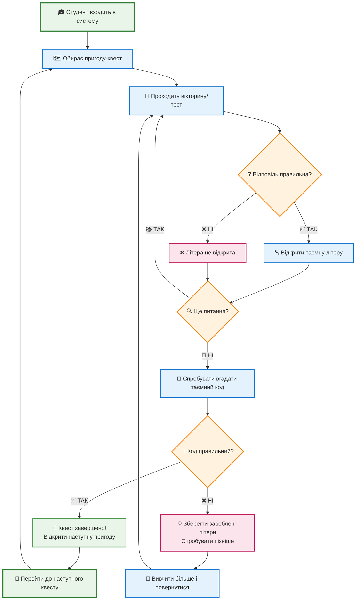
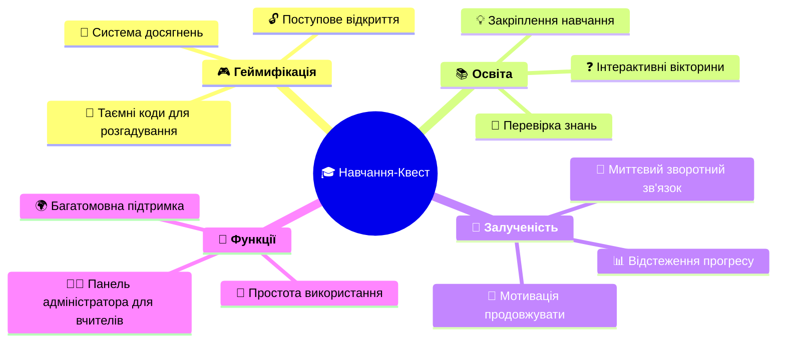

# Система Навчання "Квест" - Простий Огляд

## Що таке Система Квестів?

Система Квестів - це **ігрова навчальна платформа**, яка робить освіту веселою та захоплюючою, перетворюючи тести на пригодницькі квести з прихованими кодами для розкриття!

## Як це працює - Простий процес

## 🎮 Ключові особливості простими словами

### 🎯 **Мета**
Допомогти студентам вчитися через **ігрові вікторини**, де правильні відповіді відкривають частини таємного коду!

### 🔄 **Процес**
1. **📚 Навчання** → Проходження освітніх вікторин
2. **🎯 Заробіток** → Отримання літер за правильні відповіді  
3. **🔍 Відкриття** → Вгадування прихованого коду
4. **🚀 Прогрес** → Відкриття нових пригод

### 🏆 **Що робить це особливим**

## 🎭 **Приклад з реального життя**

**Сценарій: Географічний квест**

1. 🗺️ **Квест**: "Відкрий таємничу країну"
2. 📝 **Вікторина**: Відповісти на 10 питань з географії
3. 🔤 **Винагорода**: Кожна правильна відповідь відкриває 1 літеру
4. 🎯 **Мета**: Скласти слово "**БРАЗИЛІЯ**" (8 літер)
5. 🎉 **Успіх**: Відкрити наступний квест про столиці Południowej Америки!

## 👨‍🎓 **Ідеально підходить для**
- **Студентів**: Веселий, захоплюючий спосіб навчання
- **Вчителів**: Легко створювати та відстежувати прогрес  
- **Шкіл**: Сучасний, інтерактивний освітній інструмент
- **Всіх**: Хто хоче зробити навчання приємним!

## 🌟 **Переваги системи**

### Для студентів:
- 🎯 **Мотивація**: Ігрові елементи роблять навчання цікавим
- 🏆 **Досягнення**: Відчуття успіху від розгадування кодів
- 📈 **Прогрес**: Наочне бачення власних успіхів

### Для вчителів:
- 📊 **Аналітика**: Детальна статистика прогресу учнів
- ⚙️ **Налаштування**: Легке створення власних квестів
- 🎯 **Ефективність**: Автоматична перевірка та оцінювання

### Для навчальних закладів:
- 💻 **Сучасність**: Відповідає потребам цифрового покоління
- 🌍 **Доступність**: Працює на різних пристроях
- 📚 **Універсальність**: Підходить для будь-яких предметів

## 🚀 **Як почати**

1. **Реєстрація** → Створити обліковий запис
2. **Вибір квесту** → Обрати цікаву тему
3. **Початок гри** → Розпочати першу вікторину
4. **Насолода процесом** → Вчитися граючи!

---

*Перетворіть нудні тести на захоплюючі пригоди! 🚀*

## 📞 **Контакти та підтримка**

Маєте питання? Потрібна допомога? Ми завжди готові допомогти зробити ваше навчання ще кращим!

**Пам'ятайте**: Навчання може бути веселим! 🎓✨ 